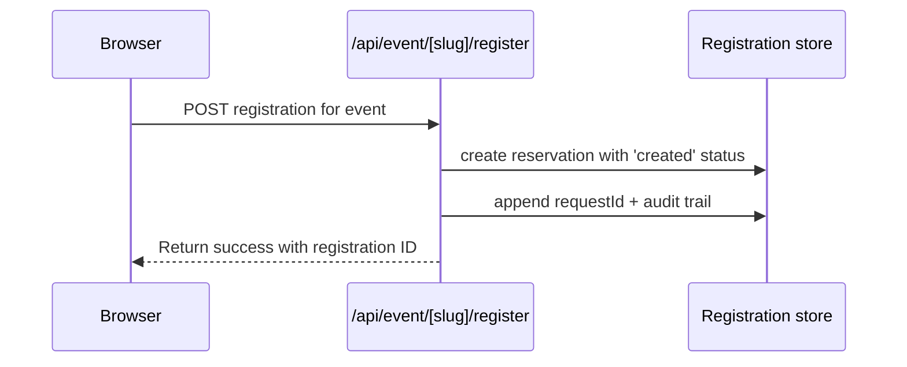

# Admin Data Flow

Use this file when you want the shortest developer explanation of how Supabase powers Book Digest.

## TL;DR

1. Supabase is the single source of truth for all data.
2. All registrations, books, events, and settings are stored in Supabase.
3. No external mirroring or forwarding systems are used.

## Mental Model

```text
Supabase = single source of truth for all data
```

## System Map

```mermaid
flowchart TD
  User[Reader submits form] --> Api[/api/event/slug/register]
  Api --> Truth[(Supabase registrations)]
  Admin[/admin] --> Truth
  Admin --> Books[(Supabase books table)]
  Admin --> Events[(Supabase events table)]
  Admin --> Settings[(Supabase settings table)]
  Public[Public pages] --> Books
  Public --> Events
  Assets[Uploaded covers and posters] --> Storage[(Supabase Storage)]
  Admin --> Storage
```

## Source Of Truth Rules

```mermaid
flowchart LR
  A{Is Supabase configured?} -->|yes| B[Supabase is source of truth]
  A -->|no| C[Cannot run - Supabase required]
  B --> D[/admin reads Supabase tables]
  B --> E[Public pages read Supabase books/events]
  B --> F[Capacity and registrations read Supabase]
```

## Registration Lifecycle



## What `/admin` Shows Now

### Registrations

1. Reads the registration store from Supabase.
2. Supports time-range filters, event filters, status filters, CSV export, and detailed audit trail.
3. Shows request id and lifecycle events.

### Assets

1. Scans current book and event references.
2. Scans actual storage contents.
3. Reports orphaned assets and missing referenced assets.
4. Prunes only orphaned assets older than the configured grace period.

## Developer Decision Guide

1. Production stack: Supabase for all data storage.
2. Event-based registration system with per-event capacity tracking.
3. Registrations start with 'created' status, progress to 'pending' after payment, then 'confirmed' after verification.

## Secret Placement

| Secret | Store in | Never store in |
| --- | --- | --- |
| `ADMIN_PASSWORD` | Vercel env / `.env.local` | client code, `NEXT_PUBLIC_*` |
| `ADMIN_SESSION_SECRET` | Vercel env / `.env.local` | client code, `NEXT_PUBLIC_*` |
| `ADMIN_API_SECRET` | Vercel env / `.env.local` | client code, `NEXT_PUBLIC_*` |
| `SUPABASE_SERVICE_ROLE_KEY` | Vercel env / `.env.local` | browser, public repo |
| Supabase DB password | password manager | public repo, client env |
| Supabase account login | password manager | repo docs, browser env |
| `RESEND_API_KEY` | Vercel env / `.env.local` | browser, public repo |
| `TURNSTILE_SECRET_KEY` | Vercel env / `.env.local` | browser, public repo |
| `SENTRY_AUTH_TOKEN` | Vercel env / `.env.local` | browser, public repo |

## Minimal Supabase Env

```bash
ADMIN_PASSWORD=...
ADMIN_SESSION_SECRET=...
ADMIN_API_SECRET=...
SUPABASE_URL=...
SUPABASE_SERVICE_ROLE_KEY=...
SUPABASE_REGISTRATIONS_TABLE=registrations
SUPABASE_EVENTS_TABLE=events
SUPABASE_VENUES_TABLE=venues
SUPABASE_BOOKS_TABLE=books
SUPABASE_SETTINGS_TABLE=settings
SUPABASE_EVENT_TYPES_TABLE=event_types
SUPABASE_STORAGE_BUCKET=admin-assets
```

## Optional Extensions

```bash
NEXT_PUBLIC_SENTRY_DSN=...
SENTRY_AUTH_TOKEN=...
```

## Operations Notes

1. Structured tracing and request IDs are always useful, even if Sentry is disabled.
2. Sentry is treated as optional monitoring, not the core request-tracing layer.
3. The asset cleanup endpoint is safe to automate only if you keep a non-zero grace period.