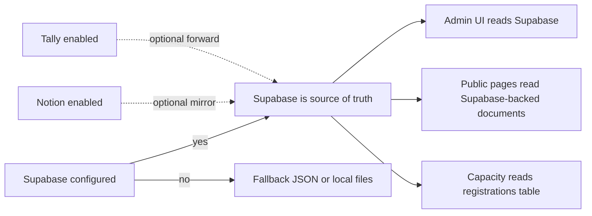

# Admin Data Flow

Use this file to understand what Supabase, Notion, and Tally each do in Book Digest.

## Short Answer

1. If you set up Supabase, you do not need Notion for the app to work.
2. If you set up Supabase, you also do not need Tally for the app to work.
3. Supabase is the recommended source of truth.
4. Notion is an optional mirror for manual review or team workflow.
5. Tally is an optional external submission destination.

## Recommended Production Shape

```mermaid
flowchart TD
  A[Reader submits form] --> B[/api/submit]
  B --> C[(Supabase registrations)]
  B --> D[(Supabase admin_documents)]
  B -. optional mirror .-> E[Notion database]
  B -. optional forward .-> F[Tally endpoint]
  G[/admin] --> C
  G --> D
  H[Public pages] --> D
```

## System Roles

### Supabase

1. Stores admin-edited content documents.
2. Stores registration records.
3. Stores uploaded admin assets when configured.
4. Is the source of truth the app reads from in production.

### Notion

1. Is not required for admin pages, public pages, or signup capacity logic.
2. Can receive a mirrored copy of a submission when `SUBMIT_SAVE_TO_NOTION=1` and `NOTION_TOKEN` plus `NOTION_DB_ID` are configured.
3. Is useful if your team still wants a Notion database for manual triage, notes, or non-technical workflows.

### Tally

1. Is not required for admin pages, public pages, or signup capacity logic.
2. Can be used in two different ways:
3. Legacy direct-browser mode: the frontend posts directly to `NEXT_PUBLIC_FORMS_ENDPOINT_*`.
4. Server-forward mode: `/api/submit` stores the registration locally first, then forwards a copy to `TALLY_ENDPOINT_*`.
5. If you want Supabase-first behavior, leave `NEXT_PUBLIC_FORMS_ENDPOINT_*` empty and keep the frontend on `/api/submit`.

## Source Of Truth Rules



## Registration Lifecycle

1. The browser submits to `/api/submit` by default.
2. `/api/submit` reserves capacity and writes a registration record to the shared registration store.
3. If Supabase is configured, that store is `public.registrations`.
4. If Notion mirror is enabled, the same submission is also written to Notion.
5. If Tally forwarding is enabled, the same submission is also forwarded to the configured Tally endpoint.
6. The registrations viewer in `/admin` reads the registration store, not Notion directly.

## What The Admin Viewer Shows

1. `/admin` registrations viewer reads from [lib/registration-store.ts](/data/yy/book-digest-web/lib/registration-store.ts).
2. In production with Supabase configured, that means it reads `public.registrations`.
3. It can show whether Notion mirroring is enabled.
4. It does not query Notion live for counts.
5. If you need a Notion-vs-Supabase reconciliation screen later, that is a separate feature.

## Decision Guide

1. Want the simplest stack: use Supabase only.
2. Want a manual CRM-style mirror for non-technical teammates: enable Notion mirror too.
3. Want to keep an external form pipeline or webhook: enable Tally forwarding too.
4. Want deterministic capacity, audit history, and admin inspection: do not bypass `/api/submit`.

## Secret Placement

| Secret | Store in | Never store in |
| --- | --- | --- |
| `ADMIN_PASSWORD` | Vercel env / `.env.local` | client code, `NEXT_PUBLIC_*` |
| `ADMIN_SESSION_SECRET` | Vercel env / `.env.local` | client code, `NEXT_PUBLIC_*` |
| `SUPABASE_SERVICE_ROLE_KEY` | Vercel env / `.env.local` | browser, public repo |
| Supabase DB password | password manager | public repo, client env |
| `NOTION_TOKEN` | Vercel env / `.env.local` | browser, public repo |
| `RESEND_API_KEY` | Vercel env / `.env.local` | browser, public repo |
| `TURNSTILE_SECRET_KEY` | Vercel env / `.env.local` | browser, public repo |

## Minimal Supabase-Only Env

```bash
ADMIN_PASSWORD=...
ADMIN_SESSION_SECRET=...
SUPABASE_URL=...
SUPABASE_SERVICE_ROLE_KEY=...
SUPABASE_ADMIN_DOCUMENTS_TABLE=admin_documents
SUPABASE_REGISTRATIONS_TABLE=registrations
SUPABASE_STORAGE_BUCKET=admin-assets
```

## Optional Mirrors And Extensions

```bash
SUBMIT_SAVE_TO_NOTION=1
NOTION_TOKEN=...
NOTION_DB_ID=...

TALLY_ENDPOINT_TW=...
TALLY_ENDPOINT_NL=...
TALLY_ENDPOINT_EN=...
TALLY_ENDPOINT_DETOX=...
```