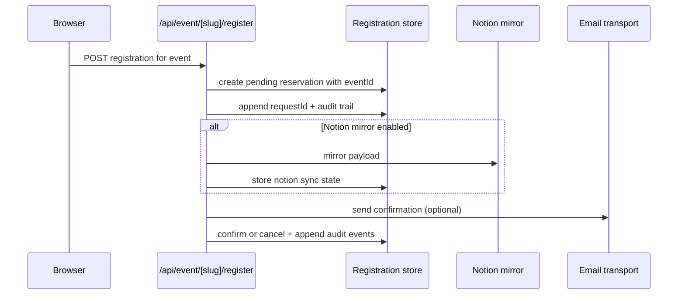

# Admin Data Flow

Use this file when you want the shortest developer explanation of how Supabase, Notion, and Tally relate to each other in Book Digest.

## TL;DR

1. If Supabase is configured, the app does not need Notion to function.
2. If Supabase is configured, the app also does not need Tally to function.
3. Supabase is the recommended source of truth.
4. Notion is an optional mirror for humans and workflow visibility.
5. Tally is an optional forward target for external form pipelines.

## Mental Model

```text
Supabase = truth the app trusts
Notion    = optional mirror for people
Tally     = optional outbound copy for legacy/external flows
```

## System Map

```mermaid
flowchart TD
  User[Reader submits form] --> Api[/api/event/slug/register]
  Api --> Truth[(Supabase registrations)]
  Api -. optional mirror .-> Notion[(Notion database)]
  Admin[/admin] --> Truth
  Admin --> Books[(Supabase books table)]
  Admin --> Events[(Supabase events table)]
  Admin --> Settings[(Supabase settings table)]
  Public[Public pages] --> Books
  Public --> Events
  Assets[Uploaded covers and posters] --> Storage[(Supabase Storage)]
  Admin --> Storage
```

## Source Of Truth Rules

```mermaid
flowchart LR
  A{Is Supabase configured?} -->|yes| B[Supabase becomes source of truth]
  A -->|no| C[Cannot run - Supabase required]
  B --> D[/admin reads Supabase tables]
  B --> E[Public pages read Supabase books/events]
  B --> F[Capacity and registrations read Supabase]
  G[Notion mirror enabled] -. does not replace truth .-> B
```

## Do I Still Need Notion?

No, not for app correctness.

Use Notion only if you want one of these:

1. non-technical teammates reviewing submissions in a familiar UI
2. manual annotations or lightweight CRM-style triage
3. an explicit mirror you can compare against from `/admin`

Do not use Notion as the operational source of truth for capacity, registration counts, or admin rendering.

## Do I Still Need Tally?

No. Tally integration has been removed in favor of direct event-based registrations through `/api/event/[slug]/register`.

If you want Supabase-first behavior, frontend forms post directly to the event registration endpoint.

## Registration Lifecycle



## What `/admin` Shows Now

### Registrations

1. Reads the registration store, not Notion directly.
2. Supports time-range filters, activity filters, CSV export, and detailed audit trail.
3. Shows request id, mirror statuses, and lifecycle events.

### Reconciliation

1. Compares source-of-truth registrations against the optional Notion mirror.
2. Shows three classes of differences:
   - missing in Notion
   - field mismatch
   - present in Notion but missing in source
3. Makes the source of truth explicit in the UI.

### Assets

1. Scans current book and event references.
2. Scans actual storage contents.
3. Reports orphaned assets and missing referenced assets.
4. Prunes only orphaned assets older than the configured grace period.

## Developer Decision Guide

1. Simplest production stack: Supabase only.
2. Need human-friendly mirror: add Notion.
3. Event-based registration system with per-event capacity tracking.

## Secret Placement

| Secret | Store in | Never store in |
| --- | --- | --- |
| `ADMIN_PASSWORD` | Vercel env / `.env.local` | client code, `NEXT_PUBLIC_*` |
| `ADMIN_SESSION_SECRET` | Vercel env / `.env.local` | client code, `NEXT_PUBLIC_*` |
| `ADMIN_API_SECRET` | Vercel env / `.env.local` | client code, `NEXT_PUBLIC_*` |
| `SUPABASE_SERVICE_ROLE_KEY` | Vercel env / `.env.local` | browser, public repo |
| Supabase DB password | password manager | public repo, client env |
| Supabase account login | password manager | repo docs, browser env |
| `NOTION_TOKEN` | Vercel env / `.env.local` | browser, public repo |
| `RESEND_API_KEY` | Vercel env / `.env.local` | browser, public repo |
| `TURNSTILE_SECRET_KEY` | Vercel env / `.env.local` | browser, public repo |
| `SENTRY_AUTH_TOKEN` | Vercel env / `.env.local` | browser, public repo |

## Minimal Supabase-Only Env

```bash
ADMIN_PASSWORD=...
ADMIN_SESSION_SECRET=...
ADMIN_API_SECRET=...
SUPABASE_URL=...
SUPABASE_SERVICE_ROLE_KEY=...
SUPABASE_REGISTRATIONS_TABLE=registrations
SUPABASE_EVENTS_TABLE=events
SUPABASE_VENUES_TABLE=venues
SUPABASE_BOOKS_TABLE=books
SUPABASE_SETTINGS_TABLE=settings
SUPABASE_EVENT_TYPES_TABLE=event_types
SUPABASE_STORAGE_BUCKET=admin-assets
```

## Optional Mirrors And Extensions

```bash
SUBMIT_SAVE_TO_NOTION=1
NOTION_TOKEN=...
NOTION_DB_ID=...

NEXT_PUBLIC_SENTRY_DSN=...
SENTRY_AUTH_TOKEN=...
```

## Operations Notes

1. Structured tracing and request IDs are always useful, even if Sentry is disabled.
2. Sentry is now treated as optional monitoring bootstrap, not the core request-tracing layer.
3. The admin reconciliation page is where you verify Notion is still a mirror, not an accidental second source of truth.
4. The asset cleanup endpoint is safe to automate only if you keep a non-zero grace period.