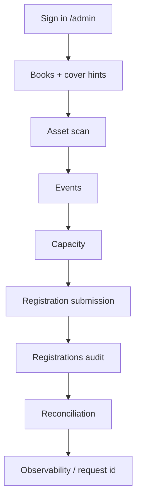

# Admin Validation Runbook

Use this file after deploys or major admin changes. The goal is to verify the full operator workflow manually, not just isolated APIs.

## Preconditions

1. `/admin` is reachable.
2. `ADMIN_PASSWORD` and `ADMIN_SESSION_SECRET` are configured.
3. If you want persistent mode validation, Supabase is configured.
4. If you want mirror validation, configure `SUBMIT_SAVE_TO_NOTION=1`, `NOTION_TOKEN`, and `NOTION_DB_ID`.
5. If you want email validation, configure `RESEND_API_KEY` plus `REGISTRATION_EMAIL_FROM`, or use `EMAIL_OUTBOX_FILE` locally.

## Validation Order



## 1. Books And Canonical Cover Hints

1. Sign in to `/admin`.
2. Open `Books`.
3. Select an existing book or create a draft.
4. Confirm both cover blocks show a canonical hint like:
   - `/images/books_zh/61_中文書名.webp`
   - `/images/books_en/61_EnglishTitle.webp`
5. Upload a Chinese cover and an English cover.
6. Confirm save succeeds and the stored path ends in `.webp`.
7. Open the public book page and confirm the new cover renders.

Expected result:

1. Upload succeeds.
2. Admin save succeeds.
3. Public page renders the new cover.
4. The canonical hint matches the numbering strategy you want for long-term library curation.

## 1A. Header And Language Toggle Layout

1. Open `/en` on desktop width.
2. Confirm the language toggle sits near the viewport's top-right edge and does not reserve space inside the header shell.
3. Compare the header content width against the sections below.
4. Resize to a narrower desktop width.
5. Confirm `Books`, `Events`, `About Us`, and `Join Us` still use the full header content width.
6. Open `/en/about-archive` or any route that only partially matches an existing nav path.

Expected result:

1. The floating language toggle does not reserve horizontal space inside the header shell.
2. On wide desktop viewports, the gap between the toggle and the right edge of the viewport stays small and visually fixed.
2. The desktop nav spans the same content width as the rest of the page.
3. Links are only highlighted on exact path matches or nested child routes, not on partial prefix collisions.

## 2. Asset Scan And Cleanup

1. Open `Assets` in `/admin`.
2. Click `Scan assets`.
3. Confirm the report shows:
   - referenced count
   - stored count
   - orphaned count
   - missing referenced count
4. If you intentionally created an orphan older than the grace period, click `Prune old orphans`.
5. Scan again.

Expected result:

1. Recently uploaded but unsaved files are protected by the grace period.
2. Old orphaned assets are deletable.
3. Missing referenced assets are visible instead of silently accumulating broken links.

## 3. Event Content

1. Open `Events`.
2. Change one event title or poster.
3. Save.
4. Open the public event page.

Expected result:

1. Admin save succeeds.
2. Public page reflects the updated title/poster.

## 4. Capacity Controls

1. Open `Capacity`.
2. Set one location to `enabled` with a valid current time window.
3. Set a small max, for example `2`.
4. Save.
5. Confirm the card shows live signup counts and remaining slots.

Expected result:

1. The location shows current live counts.
2. Remaining slots update after registrations.

## 5. Registration Submission

1. Submit a real test registration through the public form.
2. If using a local test setup, use a disposable email.
3. If email delivery is enabled, confirm the response indicates `sent` or `skipped` intentionally.

Expected result:

1. The public flow succeeds.
2. Capacity reflects the new signup.
3. `public.registrations` gains a new row in Supabase mode.

## 6. Registrations Audit Viewer

1. Open `Registrations` in `/admin`.
2. Confirm the new row appears.
3. Filter by location.
4. Filter by status.
5. Filter by source.
6. Set `Submitted after` / `Submitted before` to bracket the submission.
7. Expand `Details` on the row.
8. Export CSV.

Expected result:

1. Filters narrow the dataset correctly.
2. Expanded row shows:
   - `requestId`
   - sync states for Notion / Tally / Email
   - audit trail entries such as reservation creation and confirmation
3. CSV downloads and includes request/audit metadata.

## 7. Reconciliation

1. Open `Reconciliation` in `/admin`.
2. Click `Refresh reconciliation`.
3. Check the summary cards.
4. Inspect any rows under:
   - source rows with drift
   - Notion-only rows

Expected result:

1. The page explicitly states whether the source of truth is Supabase or the local fallback store.
2. If Notion is disabled, the summary still makes that clear.
3. If Notion is enabled, mismatches are actionable and not hidden.

## 8. Observability And Request IDs

1. Submit another test registration.
2. Open server logs.
3. Look for structured log lines containing:
   - `requestId`
   - `traceId`
   - route
   - method
   - duration
4. Confirm the registration row in the admin audit viewer shows the same `requestId`.

Expected result:

1. A single request can be traced through logs and the admin audit trail.
2. Failures include request-scoped context.

## 9. Supabase-Specific Checks

Run these only when Supabase mode is active.

1. Open Supabase Table Editor for `public.registrations`.
2. Confirm new rows contain:
   - `request_id`
   - `mirror_state`
   - `audit_trail`
3. Confirm `timestamp` is populated.
4. Confirm `external_id` is populated after a successful Notion mirror.
5. Open `public.admin_documents` and confirm:
   - `books.value` is a populated JSON array
   - `events.value` contains `TW`, `NL`, `EN`, and `DETOX`
   - `capacity.value` contains `TW`, `NL`, `EN`, and `DETOX`
   - `registration-success-email.value` contains `enabled`, `templates.zh`, and `templates.en`
6. Run this query to inspect the key-value admin store correctly:

```sql
select key, jsonb_typeof(value) as value_type, updated_at
from public.admin_documents
order by key;
```

7. If Vercel shows an empty homepage or books page, compare `books.value` against the repo seed in `data/books.json`.
8. If Vercel shows an error on `/events`, compare `events.value` against the repo seed in `data/events-content.json` and verify every event still has localized `title` and `description` fields.
9. Run `select created_at, updated_at, status, source, request_id from public.registrations order by updated_at desc limit 20;` and confirm the table uses snake_case audit columns.
10. If Vercel logs mention `/var/task/data/books.json` or `/var/task/data/events-content.json`, treat that as a deployment bug in the server fallback path rather than a missing Supabase row.
11. If Vercel logs mention missing columns such as `registrations.createdAt` or malformed filters such as `registrations.orstatus`, treat that as a server query bug in the Supabase registrations adapter.
12. Open two admin tabs that both edit the same document, such as `Books`.
13. Save a change in the first tab.
14. Save a different change in the second tab without refreshing.

Expected result:

1. The second save is rejected with a conflict instead of silently overwriting newer server state.
2. The operator is told to refresh before saving again.
3. No production route should require runtime access to `/data/*.json` after deploy; bundled seed fallbacks or Supabase rows should be sufficient.

## 10. Recommended Automation After Manual Signoff

1. Weekly asset cleanup with a 168-hour grace period.
2. Reconciliation review after enabling or changing Notion mapping.
3. Build verification with `NEXT_DIST_DIR=.next-verify npm run build`.
4. Full regression with `npm run test:components` and `npx playwright test --workers=1`.