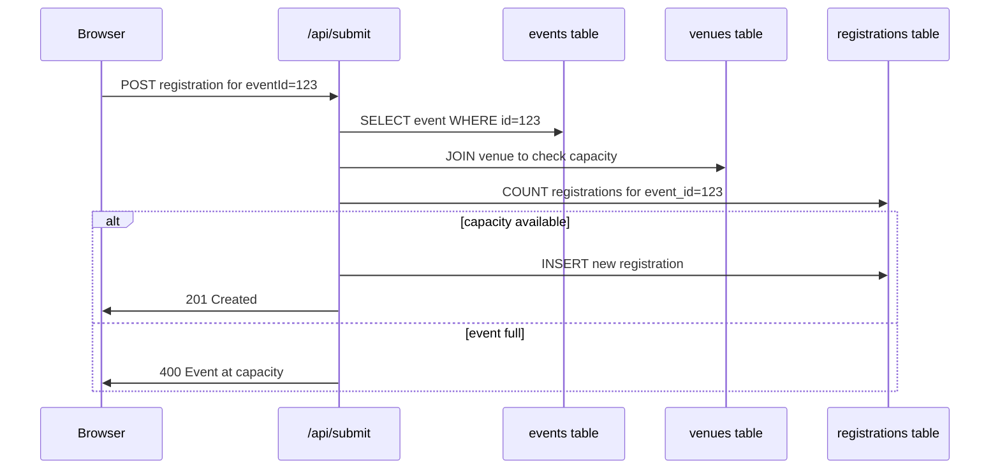

# Database Refactor: From admin_documents to Relational Schema

**Status**: Draft
**Created**: 2026-04-04
**PR**: TBD

## What & Why

Replace the `admin_documents` key-value pattern with proper relational tables to support multiple events per type, proper venues, and scalable event management. This provides better data integrity, queryability, and extensibility for future features.

**Current problems:**
- `admin_documents` mixes different resource types (books, events, capacity, email settings)
- Events are hardcoded to 4 fixed locations (TW, NL, EN, DETOX) in object structure
- No support for multiple events per event type
- Capacity is tied to location, not specific events
- Registrations only store location, not specific event_id
- No concept of venues (physical/virtual locations with addresses)

## User Stories

- **As an admin**, **I want to** create multiple events of the same type (e.g., two TW events in different months), **so that** I can schedule ongoing activities
- **As an admin**, **I want to** manage venue information separately, **so that** I can reuse venues and track their capacities
- **As a user**, **I want to** register for a specific event, **so that** I know exactly which session I'm attending
- **As a developer**, **I want to** query events and registrations relationally, **so that** I can build features like attendance lists and capacity checking efficiently

## Acceptance Criteria

- [ ] Given existing admin_documents data, when migration runs, then all books/events are preserved in new tables
- [ ] Given a venue with max capacity 30, when 30 people register for an event at that venue, then new registrations are rejected
- [ ] Given an event with type 'TW', when querying events, then I can filter by event_type and get multiple results
- [ ] Given a registration record, when I need to find the event, then I can join via event_id FK
- [ ] Given the settings table, when I toggle registration_email_enabled, then the change persists immediately

## Technical Approach

### Database Schema Design

#### Core Tables

```sql
-- Venues: physical or virtual locations
CREATE TABLE venues (
  id BIGSERIAL PRIMARY KEY,
  name TEXT UNIQUE NOT NULL,
  address TEXT,  -- Full address or virtual link (e.g., Zoom URL)
  max_capacity INTEGER NOT NULL,
  is_virtual BOOLEAN DEFAULT FALSE,
  created_at TIMESTAMPTZ DEFAULT NOW(),
  updated_at TIMESTAMPTZ DEFAULT NOW()
);

CREATE INDEX idx_venues_name ON venues(name);
CREATE INDEX idx_venues_is_virtual ON venues(is_virtual);

-- Events: scheduled reading club sessions
-- event_date stored in UTC, displayed in local time on frontend
CREATE TABLE events (
  id BIGSERIAL PRIMARY KEY,
  slug TEXT UNIQUE NOT NULL,
  event_type TEXT NOT NULL,  -- 'TW' | 'NL' | 'ONLINE' | 'DETOX' (enforced in code)
  venue_id BIGINT NOT NULL REFERENCES venues(id) ON DELETE RESTRICT,

  -- Bilingual content
  title TEXT NOT NULL,
  title_en TEXT,
  description TEXT,
  description_en TEXT,

  -- Scheduling (all timestamps in UTC)
  event_date TIMESTAMPTZ NOT NULL,
  registration_opens_at TIMESTAMPTZ,
  registration_closes_at TIMESTAMPTZ,

  -- Related book (optional)
  book_id BIGINT REFERENCES books(id) ON DELETE SET NULL,

  -- Cover images
  cover_url TEXT,
  cover_url_en TEXT,

  -- Status
  is_published BOOLEAN DEFAULT TRUE,

  created_at TIMESTAMPTZ DEFAULT NOW(),
  updated_at TIMESTAMPTZ DEFAULT NOW()
);

CREATE INDEX idx_events_type ON events(event_type);
CREATE INDEX idx_events_venue ON events(venue_id);
CREATE INDEX idx_events_date ON events(event_date);
CREATE INDEX idx_events_book ON events(book_id);
CREATE INDEX idx_events_slug ON events(slug);

-- Books: reading club books
CREATE TABLE books (
  id BIGSERIAL PRIMARY KEY,
  slug TEXT UNIQUE NOT NULL,
  sort_order INTEGER,

  -- Core fields
  title TEXT NOT NULL,
  author TEXT NOT NULL,
  read_date DATE,

  -- English translations
  title_en TEXT,
  author_en TEXT,

  -- Content (can be long)
  summary TEXT,
  summary_en TEXT,
  reading_notes TEXT,
  reading_notes_en TEXT,

  -- Arrays
  discussion_points TEXT[],
  discussion_points_en TEXT[],
  tags TEXT[],

  -- Cover images
  cover_url TEXT,
  cover_url_en TEXT,
  cover_blur_data_url TEXT,
  cover_blur_data_url_en TEXT,

  -- JSONB for flexible nested data
  links JSONB,  -- {publisher: "url", notes: "url"}
  additional_covers JSONB,  -- {zh: ["url1", "url2"], en: ["url3"]}

  created_at TIMESTAMPTZ DEFAULT NOW(),
  updated_at TIMESTAMPTZ DEFAULT NOW()
);

CREATE INDEX idx_books_slug ON books(slug);
CREATE INDEX idx_books_author ON books(author);
CREATE INDEX idx_books_read_date ON books(read_date);
CREATE INDEX idx_books_tags ON books USING GIN(tags);

-- Registrations: event signups (update existing table)
ALTER TABLE registrations
  ADD COLUMN event_id BIGINT REFERENCES events(id) ON DELETE RESTRICT,
  ADD COLUMN book_id BIGINT REFERENCES books(id) ON DELETE SET NULL;

-- Migrate existing registrations to link to events by location
-- (requires data migration script)

CREATE INDEX idx_registrations_event ON registrations(event_id);
CREATE INDEX idx_registrations_book ON registrations(book_id);

-- Settings: runtime configuration
CREATE TABLE settings (
  key TEXT PRIMARY KEY,
  value JSONB NOT NULL,
  description TEXT NOT NULL,
  updated_at TIMESTAMPTZ DEFAULT NOW(),
  updated_by TEXT
);

CREATE INDEX idx_settings_updated ON settings(updated_at DESC);
```

#### Initial Data

```sql
-- Example venues
INSERT INTO venues (name, address, max_capacity, is_virtual) VALUES
  ('Louisa Cafe Taipei Main Station', '2F, No. 3, Section 1, Zhongxiao W Rd, Zhongzheng District, Taipei City, 100', 30, false),
  ('Louisa Cafe Taipei Xinyi', '1F, No. 11, Section 5, Xinyi Rd, Xinyi District, Taipei City, 110', 25, false),
  ('Starbucks Amsterdam Centraal', 'Platform 2B, Stationsplein, 1012 AB Amsterdam, Netherlands', 25, false),
  ('Zoom Meeting Room - Book Digest', 'https://zoom.us/j/bookdigest', 100, true);

-- Example settings
INSERT INTO settings (key, value, description) VALUES
  ('registration_email_enabled', 'true', 'Send automated confirmation emails to registrants'),
  ('maintenance_mode', 'false', 'Enable maintenance mode to block new registrations'),
  ('max_daily_registrations', '50', 'Maximum registrations allowed per day across all events');
```

### Files to Create/Modify

```
lib/
  db/
    schema.sql                # Full DDL for all tables
    migrations/
      001_create_venues.sql
      002_create_events.sql
      003_create_books.sql
      004_update_registrations.sql
      005_create_settings.sql
      006_migrate_admin_documents.sql
  venues.ts                   # Venue CRUD operations
  events.ts                   # Event CRUD operations
  books.ts                    # Book CRUD operations
  settings.ts                 # Settings CRUD

  # Update existing files
  events-content.ts           # Remove admin_documents, use lib/events.ts
  books-content.ts            # Remove admin_documents, use lib/books.ts
  capacity-store.ts           # Calculate from venues + registrations
  registration-store.ts       # Add event_id FK handling

types/
  venue.ts                    # New: Venue type
  event.ts                    # Update: add venue_id, book_id
  book.ts                     # Update: match DB schema
  settings.ts                 # New: Settings type

app/api/
  admin/
    venues/
      route.ts                # CRUD endpoints for venues
    events/
      route.ts                # Update: support array structure, not fixed object
    books/
      route.ts                # Update: use lib/books.ts
    settings/
      route.ts                # New: settings management

components/admin/
  VenueManager.tsx            # New: venue CRUD UI
  EventManager.tsx            # Update: support multiple events per type
  SettingsManager.tsx         # New: settings toggle UI

docs/
  design.md                   # Update: Phase 2 data models
  admin-data-flow.md          # Update: replace admin_documents with relational tables
  supabase-deployment-checklist.md  # Update: add new table setup steps
```

### Data Model

```typescript
// types/venue.ts
export type Venue = {
  id: number;
  name: string;
  address?: string;
  maxCapacity: number;
  isVirtual: boolean;
  createdAt: string;
  updatedAt: string;
};

// types/event.ts
export type EventType = 'TW' | 'NL' | 'ONLINE' | 'DETOX';

export type Event = {
  id: number;
  slug: string;
  eventType: EventType;
  venueId: number;
  venue?: Venue;  // Joined data

  title: string;
  titleEn?: string;
  description?: string;
  descriptionEn?: string;

  eventDate: string;  // ISO timestamp in UTC
  registrationOpensAt?: string;
  registrationClosesAt?: string;

  bookId?: number;
  book?: Book;  // Joined data

  coverUrl?: string;
  coverUrlEn?: string;

  isPublished: boolean;

  createdAt: string;
  updatedAt: string;
};

// types/book.ts
export type Book = {
  id: number;
  slug: string;
  sortOrder?: number;

  title: string;
  author: string;
  readDate?: string;  // ISO date

  titleEn?: string;
  authorEn?: string;

  summary?: string;
  summaryEn?: string;
  readingNotes?: string;
  readingNotesEn?: string;

  discussionPoints?: string[];
  discussionPointsEn?: string[];
  tags?: string[];

  coverUrl?: string;
  coverUrlEn?: string;
  coverBlurDataURL?: string;
  coverBlurDataURLEn?: string;

  links?: {
    publisher?: string;
    notes?: string;
  };
  additionalCovers?: {
    zh?: string[];
    en?: string[];
  };

  createdAt: string;
  updatedAt: string;
};

// types/registration.ts (update)
export type Registration = {
  id: number;
  eventId: number;  // NEW: FK to events
  bookId?: number;  // NEW: denormalized from event

  name: string;
  email: string;
  age: number;
  profession: string;
  locale: 'zh' | 'en';

  location?: string;  // LEGACY: for migration period

  // ... other fields

  createdAt: string;
  updatedAt: string;
};

// types/settings.ts
export type SettingKey =
  | 'registration_email_enabled'
  | 'maintenance_mode'
  | 'max_daily_registrations';

export type Setting = {
  key: SettingKey;
  value: any;  // JSONB
  description: string;
  updatedAt: string;
  updatedBy?: string;
};
```

### API Changes

#### New Endpoints

```
POST   /api/admin/venues          # Create venue
GET    /api/admin/venues          # List all venues
GET    /api/admin/venues/:id      # Get venue details
PUT    /api/admin/venues/:id      # Update venue
DELETE /api/admin/venues/:id      # Delete venue (if no events reference it)

POST   /api/admin/events          # Create event
GET    /api/admin/events          # List events (support filtering by type)
GET    /api/admin/events/:id      # Get event details
PUT    /api/admin/events/:id      # Update event
DELETE /api/admin/events/:id      # Delete event (if no registrations)

GET    /api/admin/settings        # Get all settings
PUT    /api/admin/settings/:key   # Update setting
```

#### Updated Endpoints

```
GET    /api/admin/books           # Now reads from books table, not admin_documents
PUT    /api/admin/books           # Now writes to books table

GET    /api/submit                # Updated to require eventId parameter
POST   /api/submit?eventId=123    # Create registration with event FK
```

### Migration Strategy

#### Phase 1: Create new tables alongside admin_documents

```sql
-- Run migrations 001-005 to create new schema
-- Do NOT drop admin_documents yet
```

#### Phase 2: Data migration script

```sql
-- 006_migrate_admin_documents.sql

-- Migrate books from admin_documents
INSERT INTO books (
  slug, title, author, read_date,
  title_en, author_en, summary, summary_en,
  reading_notes, reading_notes_en,
  discussion_points, discussion_points_en,
  tags, cover_url, cover_url_en,
  cover_blur_data_url, cover_blur_data_url_en,
  links, additional_covers, sort_order
)
SELECT
  b->>'slug',
  b->>'title',
  b->>'author',
  (b->>'readDate')::date,
  b->>'titleEn',
  b->>'authorEn',
  b->>'summary',
  b->>'summaryEn',
  b->>'readingNotes',
  b->>'readingNotesEn',
  ARRAY(SELECT jsonb_array_elements_text(b->'discussionPoints')),
  ARRAY(SELECT jsonb_array_elements_text(b->'discussionPointsEn')),
  ARRAY(SELECT jsonb_array_elements_text(b->'tags')),
  b->>'coverUrl',
  b->>'coverUrlEn',
  b->>'coverBlurDataURL',
  b->>'coverBlurDataURLEn',
  b->'links',
  jsonb_build_object(
    'zh', b->'coverUrls',
    'en', b->'coverUrlsEn'
  ),
  (b->>'sortOrder')::integer
FROM (
  SELECT jsonb_array_elements(value) as b
  FROM admin_documents
  WHERE key = 'books'
) books_data;

-- Migrate events from admin_documents
-- This requires manual venue setup first, then:
INSERT INTO events (
  slug, event_type, venue_id,
  title, title_en, description, description_en,
  event_date, cover_url, cover_url_en
)
VALUES
  -- Manual mapping from admin_documents events to new structure
  -- Example:
  ('TW-2025-03-bamboo-sisters', 'TW', 1,
   '《竹林中的姐妹》讀書會', 'The Bamboo Sisters Book Club',
   '描述...', 'Description...',
   '2025-03-15 14:00:00+08', '/images/events/tw-march.jpg', null);

-- Migrate capacity settings
INSERT INTO settings (key, value, description)
SELECT
  'capacity_' || loc.key,
  to_jsonb(loc.value),
  'Max capacity for ' || loc.key
FROM (
  SELECT key, value
  FROM admin_documents, jsonb_each(value)
  WHERE admin_documents.key = 'capacity'
) loc;

-- Migrate email settings
INSERT INTO settings (key, value, description)
VALUES
  (
    'registration_email_enabled',
    (SELECT value->'enabled' FROM admin_documents WHERE key = 'registration-success-email'),
    'Send automated confirmation emails'
  );

-- Link existing registrations to events
-- This requires business logic to map location+date to specific events
UPDATE registrations r
SET event_id = e.id
FROM events e
WHERE r.location = e.event_type
  AND r.created_at >= e.event_date - INTERVAL '30 days'
  AND r.created_at <= e.event_date + INTERVAL '7 days'
  AND e.event_date = (
    SELECT MIN(event_date)
    FROM events e2
    WHERE e2.event_type = r.location
      AND e2.event_date >= r.created_at - INTERVAL '30 days'
  );
```

#### Phase 3: Code switchover

- Update all `lib/admin-content-store.ts` calls to use new DB functions
- Update admin UI to work with new tables
- Test thoroughly in staging

#### Phase 4: Cleanup

```sql
-- After confirming everything works
DROP TABLE admin_documents;
```

### Documentation Updates

#### docs/design.md

Update Section 6 (Data Models) and Section 10 (Phase 2):

```markdown
## 6. Data Models (TypeScript)
```ts
// Relational schema (Phase 2)
export type Book = {
  id: number;
  slug: string;
  title: string;
  author: string;
  readDate?: string;
  // ... (full schema in types/book.ts)
};

export type Event = {
  id: number;
  slug: string;
  eventType: 'TW' | 'NL' | 'ONLINE' | 'DETOX';
  venueId: number;
  eventDate: string;  // UTC
  // ... (full schema in types/event.ts)
};

export type Venue = {
  id: number;
  name: string;
  address?: string;
  maxCapacity: number;
  isVirtual: boolean;
};

export type Registration = {
  id: number;
  eventId: number;  // FK to events
  name: string;
  email: string;
  age: number;
  // ... (full schema in types/registration.ts)
};
```

## Phase 2 (Production completeness)
- Content: Supabase Postgres with relational tables (books, events, venues, settings)
- No more admin_documents key-value pattern
- Forms: Next.js API routes persisting to registrations with event_id FK
```

#### docs/admin-data-flow.md

Major rewrite of the document:

```markdown
# Admin Data Flow

## TL;DR

1. All content (books, events, venues) stored in Supabase relational tables
2. admin_documents pattern has been replaced with proper tables
3. Settings stored in dedicated settings table
4. Registrations link to events via event_id FK
5. Capacity calculated from venue.max_capacity and count(registrations)

## Mental Model

```text
Supabase Postgres = single source of truth
  ├─ books table
  ├─ events table (with FK to venues and books)
  ├─ venues table
  ├─ registrations table (with FK to events)
  └─ settings table
```

## System Map

```mermaid
flowchart TD
  User[Reader submits form] --> Api[/api/submit?eventId=123]
  Api --> Events[(events table)]
  Api --> Regs[(registrations table)]
  Api --> Venues[(venues table)]
  Admin[/admin] --> Events
  Admin --> Books[(books table)]
  Admin --> Venues
  Admin --> Settings[(settings table)]
  Public[Public pages] --> Events
  Public --> Books
```

## Source Of Truth

- **Books**: books table
- **Events**: events table (joins venues and books)
- **Venues**: venues table
- **Registrations**: registrations table (FK to events)
- **Settings**: settings table (runtime config like email_enabled)

NO MORE admin_documents table.

## Registration Lifecycle



## Capacity Checking

```typescript
const event = await getEventById(eventId);
const venue = await getVenueById(event.venueId);
const registrationCount = await countRegistrations(eventId);

if (registrationCount >= venue.maxCapacity) {
  throw new Error('Event at capacity');
}
```

## Admin Dashboard

Tabs:
- **Books**: CRUD books table
- **Events**: CRUD events table (select venue, optional book)
- **Venues**: CRUD venues table
- **Registrations**: View registrations with event details
- **Settings**: Toggle runtime settings

## Deployment Prerequisites

1. Create tables via migrations
2. Migrate data from admin_documents
3. Update code to use new tables
4. Verify capacity enforcement
5. Drop admin_documents table
```

#### docs/supabase-deployment-checklist.md

Add new table setup:

```markdown
## Database Setup

- [ ] Run migration 001_create_venues.sql
- [ ] Run migration 002_create_events.sql
- [ ] Run migration 003_create_books.sql
- [ ] Run migration 004_update_registrations.sql
- [ ] Run migration 005_create_settings.sql
- [ ] If migrating from admin_documents: run 006_migrate_admin_documents.sql
- [ ] Verify FK constraints are enforced
- [ ] Insert initial venues and settings
```

## Testing

- [ ] Unit tests: venue CRUD operations
- [ ] Unit tests: event CRUD with FK constraints
- [ ] Unit tests: capacity calculation from venue + registrations
- [ ] Integration tests: migration script preserves all data
- [ ] Integration tests: registration flow with event_id
- [ ] E2E tests: admin can create event → user can register → capacity enforced

## Security Checklist

- [ ] Input validation on all API endpoints (venue name, event dates, etc.)
- [ ] Auth/authorization for all admin endpoints (existing ADMIN_PASSWORD)
- [ ] FK constraints prevent orphaned records
- [ ] Capacity checks are atomic (use transactions)
- [ ] No sensitive data exposed in public endpoints

## Open Questions

- [x] Should event_type be Postgres ENUM or TEXT? → TEXT (code defines enum)
- [x] Should book schema use columns or id+json? → Columns with some JSONB for nested data
- [x] How to handle timezone for event_date? → Store in UTC, display in local timezone on frontend
- [x] Should we support recurring events? → No, create separate event records for each occurrence

## Implementation Notes

### Hard-coded email templates

Remove email templates from settings/admin_documents. Use code constants instead:

```typescript
// lib/email-templates.ts
export const REGISTRATION_SUCCESS_TEMPLATES = {
  zh: {
    subject: (eventTitle: string) => `Book Digest 報名成功｜${eventTitle}`,
    body: (params: {name: string; eventTitle: string; email: string; location: string; siteUrl: string}) =>
      `嗨 ${params.name}，

你已成功完成 ${params.eventTitle} 的報名。

我們會以這個信箱 ${params.email} 與你保持聯繫；若活動細節有更新，也會透過這裡通知你。

活動類型：${params.location}
官網：${params.siteUrl}

期待在線下或線上和你見面。
Book Digest`
  },
  en: {
    subject: (eventTitle: string) => `Book Digest registration confirmed | ${eventTitle}`,
    body: (params: {name: string; eventTitle: string; email: string; location: string; siteUrl: string}) =>
      `Hi ${params.name},

Your registration for ${params.eventTitle} is confirmed.

We will keep in touch through ${params.email} if any event details change.

Activity: ${params.location}
Site: ${params.siteUrl}

See you soon,
Book Digest`
  }
};
```

### Capacity checking

```typescript
// lib/capacity-checker.ts
export async function checkEventCapacity(eventId: number): Promise<{
  available: number;
  total: number;
  isFull: boolean;
}> {
  const event = await getEventById(eventId);
  const venue = await getVenueById(event.venueId);
  const registrationCount = await countRegistrationsByEventId(eventId);

  return {
    available: venue.maxCapacity - registrationCount,
    total: venue.maxCapacity,
    isFull: registrationCount >= venue.maxCapacity
  };
}
```

### Admin UI updates

The admin dashboard will need tabs:
- **Books** (existing, updated to use books table)
- **Events** (updated to support multiple per type, venue selection)
- **Venues** (new)
- **Registrations** (existing, show event details)
- **Settings** (new, simple key-value editor)

### Deployment checklist

1. Run migrations in production Supabase
2. Run data migration script
3. Deploy new code version
4. Verify admin can create events
5. Verify users can register with event_id
6. Monitor for errors
7. After 7 days of stable operation, drop admin_documents table

---

## References

- Original discussion: admin_documents key-value pattern analysis
- Supabase documentation: https://supabase.com/docs/guides/database
- Next.js App Router: https://nextjs.org/docs/app
- Current design: docs/design.md
- Current architecture: docs/admin-data-flow.md
